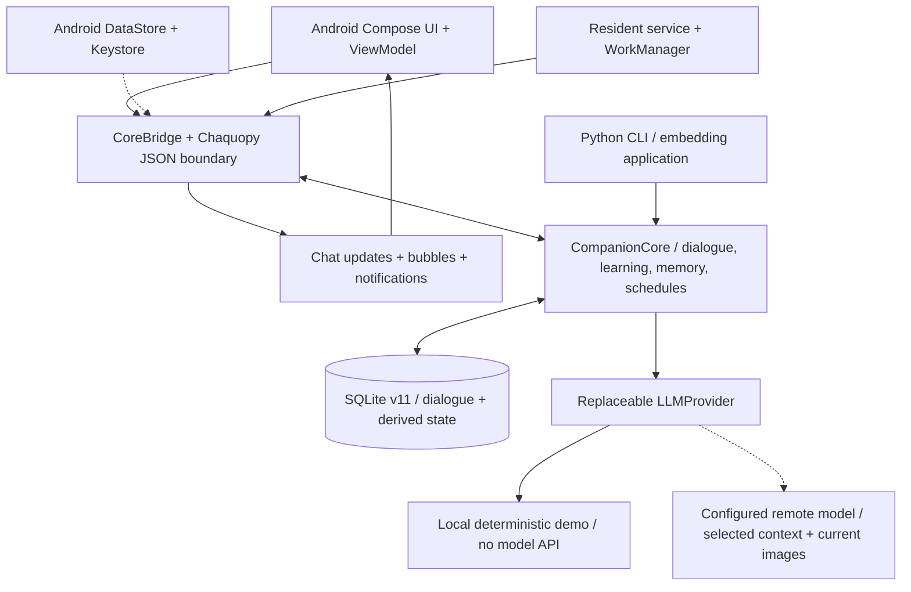
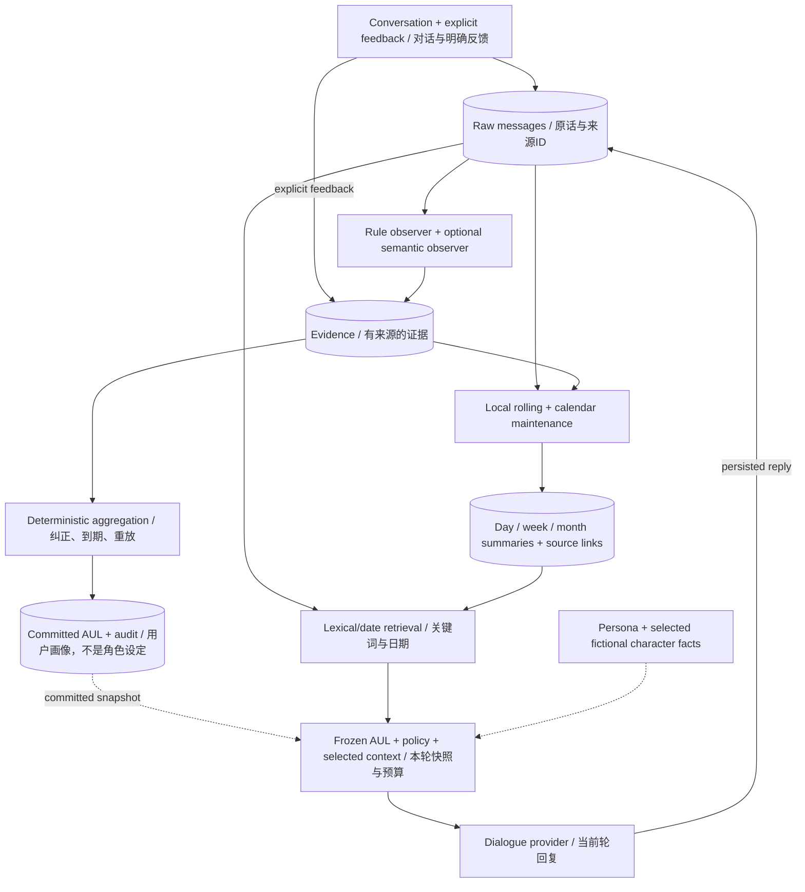
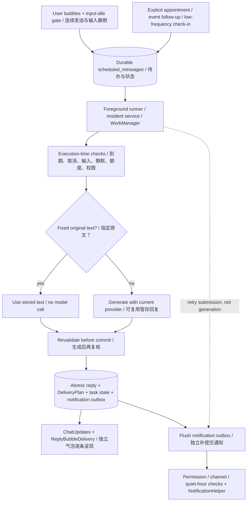

# OpenWoven Architecture / 架构说明

[中文入口](README.md) · [English entry](README.en.md) · [Memory details](MEMORY_DESIGN.md) · [Runtime details](RUNTIME_GUIDE.md)

本文对应当前单用户原型，Python/Android基础版本0.1.0、SQLite schema v11。
三张图描述已有组件的逻辑调用/数据关系，不表示所有操作同步完成，也不是效果验收。
箭头表示调用或数据流；虚线表示配置、按需读取或可选路径，不代表新服务。

The reusable Python Core runs locally; Android embeds it through Chaquopy.
These diagrams describe implemented boundaries, not model quality, exact delivery
guarantees or a deployed cloud service. Each database represents one user.

## 1. System overview / 系统总览

- Android依赖参考客户端，不是Core的使用前提；CLI或其他Python程序可直接嵌入Core。
- Android设置存于DataStore，API Key由Keystore加密保存；聊天SQLite本身未应用层加密。
  Core与设置/密钥不是同一个数据库。配置远程Provider后，选定上下文会出设备。
- 图片由Android最小权限选图/重编码，仅当前轮通过视觉请求发送；不进入AUL或反复回传。
- Full/Locked共用实现、包名和数据隔离；公开共享密码是便利入口，不是安全隔离。
- 图中没有云端任务服务器或FCM发送方：两者未配置，不应画成已经可用。

Source map： [Core](src/adaptive_companion/core.py)、[SQLite](src/adaptive_companion/storage.py)、
[Provider](src/adaptive_companion/llm.py)、[Python bridge](src/adaptive_companion/android_bridge.py)、
[Kotlin bridge](android/app/src/main/java/com/adaptive/companion/data/CoreBridge.kt)、
[Settings](android/app/src/main/java/com/adaptive/companion/data/SettingsStore.kt)、
[Secrets](android/app/src/main/java/com/adaptive/companion/data/SecureSecretStore.kt)。

## 2. Memory and learning / 记忆与学习闭环

- 每轮使用已提交的AUL快照和本轮Policy；异步学习可以与模型调用重叠，
  不改写已经组装的请求，新提交结果供之后的快照读取。不是训练模型权重。
- 默认规则Observer不调用模型；语义Observer是显式配置的可选成本。
  明确反馈和已确认问卷建立证据，空白/未知答案不冒充事实；50题原文不逐轮发送。
- 日、周、月从各自时间段的原话与证据本地提炼，**不是日摘要再次压成周、周再次压成月**。
  目录链接便于浏览，检索可直接命中旧原话。摘要保留来源、不删除原文，可失效重建。
- 日/周/月只封存已结束且可整理的时段；滚动整理有批次上限。学习待处理时暂缓，
  失败来源保留并标记不完整。查询是词项/日期检索，不是向量语义召回。
- 默认总文本预算5400估算token；角色记录按需读取，最多占360估算token且仍计入总额。
  必需设定过长可能超预算；图片、供应商计费和真实模型窗口不是这个估算的硬保证。
- Persona/虚构角色记录与用户AUL分离。删除来源会撤销相关派生记忆、角色事实和证据，
  重建受影响字段；删除是逻辑删除，不是物理擦除或撤回已上传给服务商的数据。

Source map： [Learning](src/adaptive_companion/learning.py)、[Aggregation](src/adaptive_companion/aggregator.py)、
[Feedback](src/adaptive_companion/feedback.py)、[Policy](src/adaptive_companion/policy.py)、
[Memory](src/adaptive_companion/memory.py)、[Archives](src/adaptive_companion/archives.py)、
[Retrieval](src/adaptive_companion/retrieval.py)、[Context](src/adaptive_companion/context.py)、
[Character facts](src/adaptive_companion/character_book.py)。

## 3. Scheduled delivery / 后台消息投递

- 延迟回复、手动指定消息、事件跟进和主动话题共享持久化任务，但采用各自复核规则。
  输入草稿/拼字状态只来自本应用，未发送草稿正文不送给模型；不是其他应用键盘监听。
- 模型回复生成后仍检查是否取消/改输入/进入静默等；不能发送时暂存或丢弃。
  暂存复用有条件和有效期，发生真实新发送会取消旧回合；付费请求被丢弃也要记账。
- 指定原文直接使用保存内容，不要求模型接口；生成话题用当前配置，可能付费。
  普通主动开场受通知可用性和低频限制，不反复催没有回复的人。
- 任务、回复、分条计划和通知待发箱原子保存。通知重试只重新提交已有回复，
  不重新调用模型。前台更新聊天，后台在权限/渠道/免打扰等条件允许时提交系统通知。
- 独立气泡通过共享展示队列按本地计划逐条出现；不是每个气泡独立通知。
  系统提交不证明已显示或已读。通知过期/删除会停止补发。
- 常驻有持续通知且可停止；WorkManager受系统策略影响。没有防杀保证、精确闹钟或
  已部署FCM服务。恢复、时区、省电和真实耗电仍需设备验收。

Source map： [Core execution](src/adaptive_companion/core.py)、[Input gate](src/adaptive_companion/turns.py)、
[Delayed replies](src/adaptive_companion/delayed_replies.py)、[Proactive planning](src/adaptive_companion/proactive.py)、
[Delivery plan](src/adaptive_companion/delivery.py)、
[Shared delivery](android/app/src/main/java/com/adaptive/companion/scheduler/ScheduledDelivery.kt)、
[WorkScheduler](android/app/src/main/java/com/adaptive/companion/scheduler/WorkScheduler.kt)、
[Resident service](android/app/src/main/java/com/adaptive/companion/scheduler/CompanionResidentService.kt)、
[Worker](android/app/src/main/java/com/adaptive/companion/scheduler/ProactiveWorker.kt)、
[Bubble delivery](android/app/src/main/java/com/adaptive/companion/data/ReplyBubbleDelivery.kt)、
[Notification helper](android/app/src/main/java/com/adaptive/companion/notifications/NotificationHelper.kt)。

## Publication boundaries / 发布边界

Mermaid图与模块链接随源码提交；普通Markdown编辑器不支持渲染时仍可阅读源文本。
GitHub支持围栏中的Mermaid图，见 [官方说明](https://docs.github.com/en/get-started/writing-on-github/working-with-advanced-formatting/creating-diagrams)。
使用基础flowchart语法，不依赖自定义HTML、外部图标或在线图片服务。
架构说明不代表真机、实际Provider、签名/组件许可证或GitHub CI已经验收。
详见 [安全边界](SECURITY.md) 和 [发布清单](RELEASE_CHECKLIST.md)。
